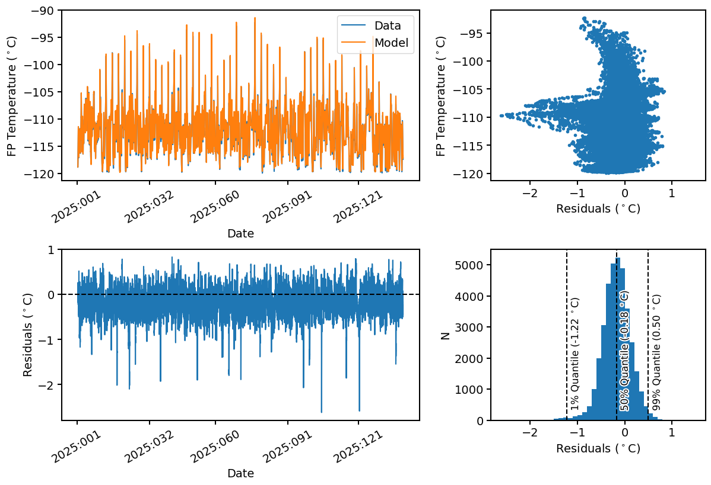

# Modeling the ACIS FP Temperature from other thermistors

The ACIS focal plane (FP) temperature is a critical factor in the operation
of the ACIS instrument on the Chandra spacecraft. The spectral response of 
the ACIS CCDs depends very strongly on this temperature. For this reason, the
FP temperature is limited for each observation, depending on the spectral 
resolution required to achieve the science goals specified by the observer. 
To ensure to the fullest extent possible that the FP temperature is within 
the specified limits, the Chandra team runs 
[predictive thermal models](https://cxc.cfa.harvard.edu/acis/FP_thermPredic/index.html) 
of the ACIS FP temperature for every observing schedule. 

However, what if the ACIS FP thermistor was lost, as has happened for other
thermistors on the spacecraft? In this case, the ability to accurately determine
the calibration needed for a partiuclar observation would be compromised. For
this reason, I have developed a machine learning model that predicts the ACIS FP
temperature from other related thermistors. This is a simple LSTM model with a
few layers, trained on the ACIS FP temperature and other thermistors from 2020-2025.

Below one can see an example prediction for the ACIS FP temperature using this model, 
against the actual temperature data (top-left panel), as well as the residuals vs. time
(bottom-left panel). In the top-right panel, the residuals are compared to the 
temperature itself, the bottom-right panel shows the residual histogram. Currently, the
model is able to predict the ACIS FP temperature with 1% and 99% quantiles of -0.8 $^\circ$C
and 0.6 $^\circ$C, respectively. 

